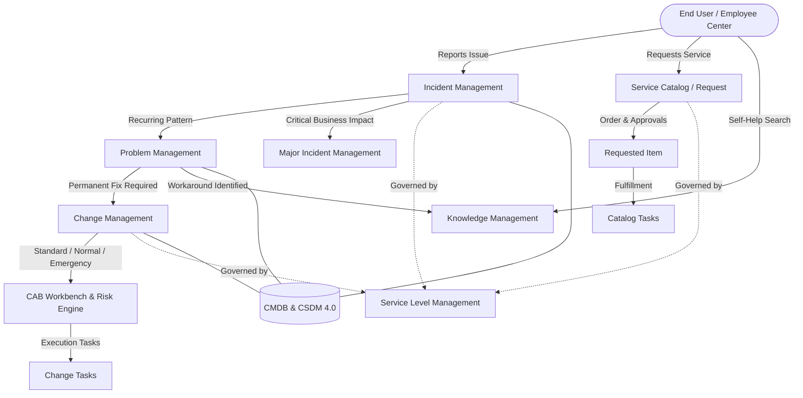
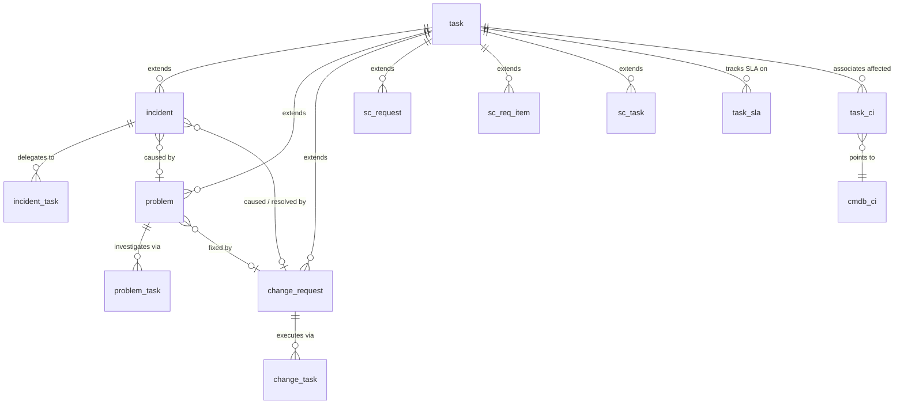
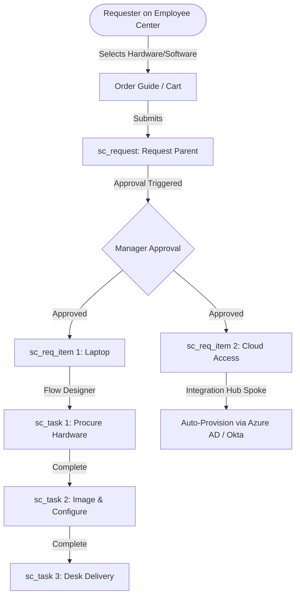
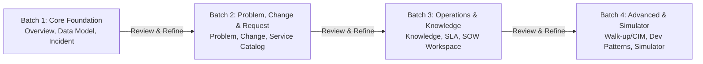

# ServiceNow IT Service Management (ITSM)
## Master Curriculum, Architecture Blueprint & Knowledge Base Overview

> **Document Purpose:** This document serves as the comprehensive architectural reference, curriculum roadmap, data model specification, and simulator blueprint for building the **ITSM Module** on the **SNLearn** platform (`d:\Work\Learning`).

---

## 1. Executive Summary & Module Scope

**IT Service Management (ITSM)** is the core foundational pillar of the ServiceNow platform. Rooted in the **ITIL v4 (Information Technology Infrastructure Library)** framework and enhanced with modern **Service Operations Workspace (SOW)**, **Common Service Data Model (CSDM 4.0)**, and **Now Assist GenAI**, ITSM automates the end-to-end lifecycle of IT services, infrastructure incidents, problem root-cause investigations, infrastructure changes, service catalog fulfillment, and knowledge management.

Unlike isolated business applications, ServiceNow ITSM is deeply interconnected with the CMDB, Asset Management (HAM/SAM), Security Operations (SecOps), and Integrated Risk Management (IRM). Because ITSM encompasses a vast operational footprint, this curriculum expands beyond the standard 7-page layout to an **expanded 12-page structure** to provide enterprise-grade depth for developers, architects, and candidates preparing for the **CIS-ITSM (Certified Implementation Specialist - ITSM)** certification.

---

## 2. Proposed Website Page Structure (`/itsm/*`)

To properly balance pedagogical clarity and technical depth, the ITSM section is architected into **12 dedicated pages**:

| # | Route | Page Title | Core Focus & Purpose |
|---|---|---|---|
| 1 | `/itsm/overview` | **ITSM Overview & Architecture** | ITIL v4 alignment, platform foundations, core roles, global architecture, and SOW evolution. |
| 2 | `/itsm/data-model` | **Master Data Model & CSDM** | The `task` table hierarchy, CMDB/CSDM 4.0 integration, relationships, and table inheritance. |
| 3 | `/itsm/incident-management` | **Incident & Major Incident (MIM)** | Rapid service restoration, state model, priority matrix, MIM workbench, on-call & PIR. |
| 4 | `/itsm/problem-management` | **Problem Management & KEDB** | Root cause analysis (RCA), problem tasks, workaround management, and Known Error Database. |
| 5 | `/itsm/change-management` | **Change & Release Management** | Change Models (Normal, Standard, Emergency, Unauthorized), Risk Engine, Conflict Detection & CAB. |
| 6 | `/itsm/service-catalog` | **Service Catalog & Request Fulfillment** | 3-tier model (`sc_request` -> `sc_req_item` -> `sc_task`), Record Producers, Order Guides & Flow Designer. |
| 7 | `/itsm/knowledge-management` | **Knowledge Management (KCS)** | Knowledge bases, article lifecycles, versioning, User Criteria security, and KCS resolution generation. |
| 8 | `/itsm/sla-management` | **Service Level Management (SLM)** | SLA definitions, OLAs, Underpinning Contracts (UCs), retroactive start, pause conditions & repair jobs. |
| 9 | `/itsm/service-operations-workspace` | **Service Operations Workspace & Now Assist** | SOW unified workspace, interaction records, Advanced Work Assignment (AWA), and GenAI summarization. |
| 10 | `/itsm/walkup-and-cim` | **Walk-up Experience & CIM** | Kiosk appointment booking, queue management, Tech Lounge support, and Continual Improvement Management. |
| 11 | `/itsm/developer-patterns` | **Developer Patterns & APIs** | Script Includes (`IncidentUtils`, `ChangeUtils`), business rules, Flow Designer actions, and REST/Table APIs. |
| 12 | `/itsm/simulator` | **Interactive ITSM Simulator** | Full multi-table interactive simulation across the end-to-end incident-problem-change-request lifecycle. |

---

## 3. Exhaustive Topics & Subtopics per Page

### Page 1: Overview & Architecture (`/itsm/overview`)
* **1. Foundations of Modern ITSM**
  * Evolution from ITIL v3 (processes) to ITIL v4 (Service Value System & Value Streams).
  * Key ITSM Guiding Principles: Focus on value, start where you are, progress iteratively, optimize & automate.
* **2. The ServiceNow ITSM Ecosystem**
  * Core modules breakdown: Incident, Problem, Change, Request, Knowledge, Service Level Management.
  * Extended capabilities: Major Incident Management, Walk-up Experience, Continual Improvement Management (CIM), On-Call Scheduling.
  * Intersection with ITOM (Discovery, Service Mapping, Event Management) and ITAM (HAM, SAM).
* **3. Role-Based Access Control (RBAC) in ITSM**
  * Baseline Roles: `itil`, `itil_admin`, `incident_manager`, `problem_manager`, `change_manager`, `knowledge_admin`, `catalog_admin`, `sla_admin`.
  * Requester Roles: `snc_internal`, `snc_external`, Employee Center access.
* **4. Architecture & Platform Engine**
  * Task extension model advantages.
  * Next Experience Framework and Service Operations Workspace (SOW) interface.
  * Process Automation Engine: Flow Designer vs. Legacy Workflows vs. Business Rules.

---

### Page 2: Master Data Model & CSDM 4.0 Integration (`/itsm/data-model`)
* **1. The `task` Super-Table Hierarchy**
  * Polymorphism in ServiceNow: How `incident`, `problem`, `change_request`, `sc_request`, `sc_req_item`, `sc_task` inherit from `task`.
  * Inherited fields: `sys_id`, `number`, `short_description`, `description`, `state`, `priority`, `urgency`, `impact`, `assignment_group`, `assigned_to`, `cmdb_ci`, `opened_at`, `closed_at`.
  * Performance implications of deep inheritance, table flattening (Task Splitting), and indexing.
* **2. Common Service Data Model (CSDM 4.0) in ITSM**
  * The 4 CSDM Domains: *Foundation*, *Design*, *Manage Technical Services*, *Sell/Consume*.
  * Mapping CIs to ITSM: Business Services (`cmdb_ci_service`), Service Offerings (`service_offering`), Application Services (`cmdb_ci_service_discovered`), Technical Service Offerings, and Dynamic CI Groups.
  * Impact Analysis: How selecting a Configuration Item (`cmdb_ci`) automatically populates affected business services and calculates business criticality.
* **3. Entity Relationship Architecture**
  * Primary keys, foreign keys, and Many-to-Many (`sys_m2m`) intersection tables:
    * `task_ci` (Affected CIs)
    * `task_cmdb_ci_service` (Impacted Services/Offerings)
    * `task_sla` (Active & historical SLAs)
    * `cmdb_ci_outage` (Outages linked to Incidents/Changes)

---

### Page 3: Incident Management & Major Incident Management (`/itsm/incident-management`)
* **1. Incident Lifecycle & State Model**
  * Baseline States: `New (1)` $\rightarrow$ `In Progress (2)` $\rightarrow$ `On Hold (3)` $\rightarrow$ `Resolved (6)` $\rightarrow$ `Closed (7)` $\rightarrow$ `Canceled (8)`.
  * On Hold Reasons: `Awaiting Caller`, `Awaiting Change`, `Awaiting Problem`, `Awaiting Vendor`.
  * Auto-Resolution and Auto-Close business rules (e.g., `incident autoclose` after 5/7 days in Resolved).
* **2. Priority Calculation Engine**
  * Data Lookup Definitions on `dl_u_priority`: $\text{Impact} \times \text{Urgency} = \text{Priority}$ ($1\text{-Critical}$ to $5\text{-Planning}$).
  * Dynamic VIP caller escalation & VIP styling on forms.
  * Incident categorization and tiered subcategories (`category`, `subcategory`).
* **3. Major Incident Management (MIM)**
  * Criteria for Major Incidents: P1/P2 thresholds, business impact, critical service degradation.
  * Major Incident Lifecycle: `Proposed` $\rightarrow$ `Accepted` / `Rejected` $\rightarrow$ `Resolved` $\rightarrow$ `Closed`.
  * Major Incident Workbench: Communication plans (`incident_alert`), stakeholder communication matrix, conference bridge coordination, and Post-Incident Review (PIR) generation.
* **4. Incident Tasks & On-Call Routing**
  * `incident_task`: Parallel investigation across multiple technical silos (Network, Database, Storage).
  * Integration with On-Call Scheduling (`cmn_rota`) for automated escalation and SMS/phone paging.

---

### Page 4: Problem Management & Known Error Database (`/itsm/problem-management`)
* **1. Proactive vs. Reactive Problem Management**
  * Reactive: Initiated from one or more major/recurring incidents (`incident.problem_id`).
  * Proactive: Trend analysis of CMDB components, ITOM event clusters, and vendor vulnerability alerts.
* **2. Problem Lifecycle & State Model**
  * States: `New (101)` $\rightarrow$ `Assess (102)` $\rightarrow$ `Root Cause Analysis / RCA (103)` $\rightarrow$ `Fix in Progress (104)` $\rightarrow$ `Resolved (105)` $\rightarrow$ `Closed (107)` $\rightarrow$ `Canceled (108)`.
  * Resolution Codes: `Solved Permanently`, `Solved (Workaround)`, `Risk Accepted`, `Not Solved (Too Costly)`.
* **3. Problem Tasks (`problem_task`)**
  * Types: `General`, `Root Cause Analysis`, `Workaround`, `Permanent Fix`.
  * Sequential vs Parallel task execution across specialized resolver groups.
* **4. Known Error Database (KEDB) & Workarounds**
  * Documenting the Workaround on the Problem record.
  * Auto-publishing Known Error Articles to Knowledge Base (`kb_template_known_error_article`) via Flow Designer.
  * Cascading resolution: Closing/resolving associated incidents when a problem is solved.

---

### Page 5: Change & Release Management (`/itsm/change-management`)
* **1. Change Management Types & Modern Change Models**
  * Legacy Change Types vs Modern **Change Models** (`chg_model`):
    * **Normal Change:** Two-stage approval (Technical assessment + CAB), full risk assessment.
    * **Standard Change:** Pre-approved, low-risk, recurring changes maintained in the Standard Change Catalog (`std_change_producer_version`).
    * **Emergency Change:** Expedited workflow for critical outages, Emergency CAB (ECAB) approval, retrospective review.
    * **Unauthorized Change:** Automated detection via Discovery/Service Mapping delta comparisons.
* **2. Change Request State Lifecycle**
  * States: `New (-5)` $\rightarrow$ `Assess (-4)` $\rightarrow$ `Authorize (-3)` $\rightarrow$ `Scheduled (-2)` $\rightarrow$ `Implement (-1)` $\rightarrow$ `Review (0)` $\rightarrow$ `Closed (3)` $\rightarrow$ `Canceled (4)`.
* **3. Risk Assessment & Conflict Detection Engine**
  * Risk Calculation: Assessment questionnaires (`change_risk_assessment`), composite scoring matrix, impact thresholds.
  * Conflict Detection Engine: Validates blackout windows (`cmn_schedule`), maintenance windows, and CI schedule collisions.
* **4. CAB Workbench & Release Integration**
  * CAB Meeting Automation: `cab_meeting`, `cab_agenda_item`, `cab_attendee`, real-time voting, and automated approval stamping.
  * Release Management linkage: `rm_release` and `rm_feature` bundling multiple change requests into coordinated release trains.

---

### Page 6: Service Catalog & Request Fulfillment (`/itsm/service-catalog`)
* **1. The 3-Tier Request Execution Architecture**
  * **Request (`sc_request` / REQ):** The overarching order header / "shopping cart" container, handling financial approvals.
  * **Requested Item (`sc_req_item` / RITM):** The specific catalog item requested, holding unique variable values and its dedicated fulfillment workflow.
  * **Catalog Task (`sc_task` / SCTASK):** Granular manual or automated tasks assigned to specific fulfillment groups.
* **2. Catalog Definitions & Hierarchy**
  * Catalogs (`sc_catalog`) $\rightarrow$ Categories (`sc_category`) $\rightarrow$ Catalog Items (`sc_cat_item`).
  * Catalog Item Types: Standard Items, Record Producers (creates Incident/HR/Change), Order Guides (`sc_cat_item_guide`), Content Items, Wizard Items.
* **3. Variables & Variable Sets**
  * Variable Types: Single Line Text, Reference, Select Box, Lookup Select Box, Multi-Row Variable Set (MRVS), Container Split, Attachment.
  * Catalog Client Scripts vs UI Policies: Client-side dynamic control, variable visibility, mandatory toggles, and regex validation.
* **4. Modern Request Automation with Flow Designer**
  * Triggering on `sc_req_item` creation.
  * Manager approvals, group approvals, condition branches, parallel catalog tasks, and Integration Hub spoke triggers (e.g., Active Directory user creation, AWS VM provisioning).

---

### Page 7: Knowledge Management & KCS (`/itsm/knowledge-management`)
* **1. Knowledge Base Architecture**
  * Knowledge Bases (`kb_knowledge_base`) as independent domains with dedicated managers, workflows, and access controls.
  * Hierarchical Category Structure (`kb_category`).
* **2. Article Lifecycle & Workflows**
  * States: `Draft` $\rightarrow$ `Review` $\rightarrow$ `Published` $\rightarrow$ `Pending Retirement` $\rightarrow$ `Retired`.
  * Out-of-the-box Workflows: Knowledge - Instant Publish, Knowledge - Approval Publish, Knowledge - Instant Retire.
  * Article Versioning (`kb_version`) and comparison diff tools.
* **3. Security & Access via User Criteria**
  * `Can Read` vs `Cannot Read` (`kb_uc_can_read_mtom`, `kb_uc_cannot_read_mtom`).
  * `Can Contribute` vs `Cannot Contribute` (`kb_uc_can_contribute_mtom`, `kb_uc_cannot_contribute_mtom`).
  * Combining role, group, department, location, and script-based criteria.
* **4. Knowledge-Centered Service (KCS)**
  * Generating Knowledge articles directly from Incident and Problem resolution notes.
  * Knowledge Search integration in Agent Assist and Employee Center.
  * Knowledge feedback loop: `kb_feedback`, helpful ratings, view counters (`kb_use`), and flag for review.

---

### Page 8: Service Level Management (SLM / SLA) (`/itsm/sla-management`)
* **1. SLA Foundations & Architecture**
  * Core SLA Types:
    * **SLA (Service Level Agreement):** Customer-facing service commitment (e.g., End-user incident resolution within 4 hours).
    * **OLA (Operational Level Agreement):** Internal agreements between IT departments (e.g., Database team response within 30 minutes).
    * **UC (Underpinning Contract):** Agreement between internal IT and 3rd party external vendor (e.g., ISP fiber repair within 2 hours).
* **2. SLA Definitions (`contract_sla`)**
  * Start Conditions, Pause Conditions (e.g., `incident.state == On Hold && on_hold_reason == Awaiting Caller`), Stop Conditions, and Reset Conditions.
  * Retroactive Start calculation based on `opened_at` vs `sys_created_on`.
  * Schedules (`cmn_schedule`): 24x7 vs 8x5 Business Hours vs Holiday exclusions.
* **3. Task SLA Records (`task_sla`) & Calculation Engine**
  * Stages: `In Progress`, `Paused`, `Breached`, `Achieved`, `Cancelled`.
  * Elapsed Time, Business Elapsed Time, Remaining Time, Business Remaining Percentage.
  * SLA Breach Workflow & Notifications at 50%, 75%, 100% threshold triggers.
  * SLA Repair Engine (`SLARepair` script include & `sla_repair_log`).

---

### Page 9: Service Operations Workspace (SOW) & Now Assist (`/itsm/service-operations-workspace`)
* **1. Service Operations Workspace (SOW) Overview**
  * Unified workspace bringing together IT Service Desk and IT Operations (ITOM).
  * Configurable workspace landing page, team performance metrics, and contextual sidebars.
* **2. Omnichannel Interactions & Advanced Work Assignment (AWA)**
  * Interaction Records (`interaction`): Tracking incoming phone calls, walk-ups, Agent Chat, and Virtual Agent sessions before creating Incidents/Requests.
  * Advanced Work Assignment (AWA): `awa_queue`, routing rules, work items (`awa_work_item`), agent capacity, and availability presence (`awa_agent_presence`).
* **3. Agent Assist & Contextual Intelligence**
  * Real-time recommendation of related Knowledge Articles, similar resolved Incidents, and Known Error articles based on short description ML embeddings.
* **4. Now Assist (Generative AI) for ITSM**
  * Incident Summarization: Generating instant case executive summaries from activity stream history.
  * Resolution Notes Generation: Summarizing technical steps taken to resolve an issue for caller communications.
  * Virtual Agent Conversational Exchange & GenAI Search integration.

---

### Page 10: Walk-up Experience & Continual Improvement (`/itsm/walkup-and-cim`)
* **1. Walk-up Experience (Tech Lounge / Genius Bar)**
  * Kiosk Check-in (`sn_walkup_kiosk`): Badge scan or employee ID check-in for on-site tech bars.
  * Online Appointment Booking: Reserving support slots through Employee Center (`sn_walkup_appointment`).
  * Queue Management: Real-time estimated wait times, SMS queuing notifications (`sn_walkup_queue_entry`), and technician assignment.
* **2. Continual Improvement Management (CIM)**
  * CIM Register (`sn_cim_register`): Capturing improvement initiatives from SLA breaches, customer satisfaction (CSAT) surveys, or ITIL audit findings.
  * CIM Tasks (`sn_cim_task`): Tracking measurable KPIs, ROI calculations, and milestone objectives.

---

### Page 11: Developer Patterns, Script Includes & APIs (`/itsm/developer-patterns`)
* **1. Script Include Extension Pattern (`*Utils` and `*UtilsSNC`)**
  * The Dual-Script Include architecture: `IncidentUtils` (customer-customizable) extending `IncidentUtilsSNC` (read-only ServiceNow baseline).
  * Method overriding without losing upgrade compatibility.
  * Core ITSM Script Includes: `IncidentUtils`, `ChangeUtils`, `ChangeRequest`, `ProblemUtils`, `CartJS`, `SLAUtil`.
* **2. Business Rules & State Interceptors**
  * State transition validation rules (preventing skipping states, enforcing mandatory resolution fields on Resolve).
  * Display Business Rules with `g_scratchpad` for client script performance optimization.
* **3. REST & Scripted Web Services for ITSM**
  * Standard Table API (`/api/now/table/incident`).
  * Specialized Change REST API (`/api/sn_chg_rest/change`).
  * Service Catalog API (`/api/sn_sc/servicecatalog/items/{sys_id}/order_now`).
* **4. Debugging & Performance Optimization**
  * Avoiding nested `GlideRecord` loops in before/after business rules.
  * Indexing foreign keys and using `GlideAggregate` for dashboard metrics.

---

### Page 12: Interactive ITSM Process Simulator (`/itsm/simulator`)
* **1. Multi-Table Interactive Workflow Journey**
  * An end-to-end simulation representing a realistic enterprise crisis scenario and day-to-day operations:
    1. **Incident Record (`incident`)**: Critical VPN outage reported by executive caller, mapped to Business Service `Global Enterprise Network`.
    2. **Priority Matrix Evaluation (`dl_u_priority`)**: Impact 1 + Urgency 1 = Priority 1 (Critical). SLA starts ticking.
    3. **Major Incident Promotion (`incident_alert`)**: MIM accepted, conference bridge launched, communication broadcasted.
    4. **Incident Task (`incident_task`)**: Network engineering team assigned to isolate firewall logs.
    5. **Problem Investigation (`problem`)**: Root Cause Analysis confirms memory leak in VPN Gateway firmware version v4.2.
    6. **Workaround & KCS Article (`kb_knowledge`)**: Published workaround article for remote workers switching to secondary gateway.
    7. **Change Request (`change_request`)**: Core Change Request record. Example records demonstrate all key change types:
       * **Normal Change:** Two-stage approval (Technical assessment + CAB), full risk assessment & schedule window.
       * **Standard Change:** Pre-approved recurring firewall rule adjustment template (`std_change_producer_version`).
       * **Emergency Change:** Expedited workflow for crisis outage with ECAB authorization.
       * **Unauthorized Change:** Discovery-detected configuration drift requiring retroactive remediation.
    8. **Change Tasks (`change_task`)**: Execution task to apply firmware patch + rollback validation task.
    9. **Service Catalog Request (`sc_req_item` / `sc_task`)**: Automated procurement request for permanent hardware capacity upgrade.
    10. **SLA Validation (`task_sla`)**: Verification that Response SLA and Resolution SLA met target criteria.
* **2. Interactive Simulator Features**
  * Tabbed data explorer with realistic ServiceNow field layouts.
  * Visual choice fields, reference lookups, state pill badges, and timeline diagrams.
  * Deep-dive "Process Explanation" step-by-step breakdowns for every table.

---

## 4. Comprehensive Master Table Registry

| Domain | Table Name | Table Label | Extends | Core Role / Purpose |
|---|---|---|---|---|
| **Base** | `task` | Task | None | Polymorphic root super-table for all work items. |
| **Base** | `task_sla` | Task SLA | None | Tracks active & historical SLA instances on any task. |
| **Base** | `task_ci` | Affected CI | None | Many-to-Many link between tasks and affected CIs. |
| **Base** | `task_cmdb_ci_service` | Impacted Services | None | Many-to-Many link between tasks and impacted services. |
| **Base** | `interaction` | Interaction | None | Omnichannel interaction record (chat, call, walkup). |
| **Incident** | `incident` | Incident | `task` | Core incident record for IT service disruptions. |
| **Incident** | `incident_task` | Incident Task | `task` | Sub-task for parallel incident investigation. |
| **Incident** | `incident_alert` | Incident Alert | None | Major Incident Management communication container. |
| **Incident** | `major_incident_trigger_rule` | MI Trigger Rule | None | Automated rules for proposing/promoting major incidents. |
| **Problem** | `problem` | Problem | `task` | Root cause investigation and permanent fix tracking. |
| **Problem** | `problem_task` | Problem Task | `task` | Granular problem assignments (RCA, workaround, fix). |
| **Problem** | `kb_template_known_error_article` | Known Error Article | `kb_knowledge` | Specialized template for documenting known errors. |
| **Change** | `change_request` | Change Request | `task` | Governs changes to IT services and infrastructure (Normal, Standard, Emergency, Unauthorized). |
| **Change** | `change_task` | Change Task | `task` | Planning, implementation, and testing tasks for changes. |
| **Change** | `chg_model` | Change Model | None | Defines states, transitions, and rules for change types. |
| **Change** | `change_risk_assessment` | Risk Assessment | None | Survey-based risk scoring for change requests. |
| **Change** | `change_risk_details` | Risk Details | None | Calculated risk scores based on conditions/CI impact. |
| **Change** | `change_collision` | Conflict Detection | None | Stores detected blackout or CI scheduling conflicts. |
| **Change** | `cab_meeting` | CAB Meeting | None | CAB meeting schedule, timing, and board definitions. |
| **Change** | `cab_agenda_item` | CAB Agenda Item | None | Individual change requests queued for CAB review. |
| **Change** | `cab_attendee` | CAB Attendee | None | Board members and delegates attending CAB meetings. |
| **Change** | `std_change_proposal` | Std Change Proposal | `task` | Proposal workflow to certify new Standard Changes. |
| **Change** | `std_change_producer_version` | Std Change Version | None | Approved, versioned Standard Change templates. |
| **Release** | `rm_release` | Release | `task` | Umbrella release record bundling multiple changes. |
| **Release** | `rm_feature` | Feature | `task` | Granular features delivered as part of a release. |
| **Request** | `sc_catalog` | Catalog | None | Master catalog container (e.g., Service Catalog, HR Catalog). |
| **Request** | `sc_category` | Category | None | Categorical grouping of catalog items. |
| **Request** | `sc_cat_item` | Catalog Item | None | Baseline definition for orderable goods and services. |
| **Request** | `sc_cat_item_guide` | Order Guide | `sc_cat_item` | Guided multi-item ordering wizard (e.g., Onboarding). |
| **Request** | `item_option_new` | Variable | None | Form variable questions (fields) on catalog items. |
| **Request** | `item_option_new_set` | Variable Set | None | Reusable group of variables across multiple catalog items. |
| **Request** | `sc_request` | Request (REQ) | `task` | Parent shopping cart order container. |
| **Request** | `sc_req_item` | Requested Item (RITM) | `task` | Specific item ordered with unique variable responses. |
| **Request** | `sc_task` | Catalog Task (SCTASK) | `task` | Fulfillment tasks assigned to technician teams. |
| **Request** | `sc_item_option` | Variable Value | None | Stored answer/value for a variable on a submitted RITM. |
| **Request** | `sc_item_option_mtom` | Variable M2M | None | Links stored variable answers (`sc_item_option`) to RITM. |
| **Knowledge** | `kb_knowledge_base` | Knowledge Base | None | Top-level container for articles with distinct security. |
| **Knowledge** | `kb_knowledge` | Knowledge Article | None | Central repository for self-help and technical articles. |
| **Knowledge** | `kb_category` | Knowledge Category | None | Hierarchical taxonomy within a knowledge base. |
| **Knowledge** | `kb_feedback` | Knowledge Feedback | None | Ratings, comments, and flags submitted by users. |
| **Knowledge** | `kb_use` | Knowledge Usage | None | Tracks view counts and attachment to tasks. |
| **Knowledge** | `kb_version` | Knowledge Version | None | Version history tracking revisions of articles. |
| **Knowledge** | `user_criteria` | User Criteria | None | Rules determining who can read/contribute to KBs. |
| **SLA** | `contract_sla` | SLA Definition | None | Configuration rules for timing, target, start/pause/stop. |
| **SLA** | `cmn_schedule` | Schedule | None | Business calendar (e.g., 8-5 Weekdays, 24x7, Holidays). |
| **SLA** | `cmn_schedule_span` | Schedule Entry | None | Time slots and recurrence rules within a schedule. |
| **SLA** | `sla_condition_rule` | SLA Condition Rule | None | Scripted condition logic classes for SLA evaluation. |
| **SOW & AWA** | `awa_queue` | AWA Queue | None | Work item distribution queues based on skills & conditions. |
| **SOW & AWA** | `awa_work_item` | AWA Work Item | None | Individual item being routed to available agents. |
| **SOW & AWA** | `awa_agent_presence` | Agent Presence | None | Real-time agent status (Available, Busy, Offline). |
| **Walk-up** | `sn_walkup_kiosk` | Walk-up Kiosk | None | Physical kiosk config for badge/touch check-in. |
| **Walk-up** | `sn_walkup_appointment` | Walk-up Appointment | None | Reserved time slots for on-site tech bar appointments. |
| **Walk-up** | `sn_walkup_queue_entry` | Walk-up Queue Entry | None | Live waitlist queue entry for walk-in users. |
| **CIM** | `sn_cim_register` | CIM Initiative | None | Continual improvement register tracking improvement goals. |
| **CIM** | `sn_cim_task` | CIM Task | `task` | Actionable work items to execute improvement initiatives. |
| **CMDB** | `cmdb_ci` | Configuration Item | None | Base physical or logical infrastructure item. |
| **CMDB** | `cmdb_rel_ci` | CI Relationship | None | Upstream and downstream dependency mapping. |
| **CMDB** | `cmdb_ci_service` | Business Service | `cmdb_ci` | CSDM service consumed by business users. |
| **CMDB** | `service_offering` | Service Offering | `cmdb_ci_service` | Specific tier or SLA variant of a business service. |
| **CMDB** | `cmdb_ci_outage` | Outage | None | Tracks service degradation, outage, and maintenance logs. |

---

## 5. Website Implementation Plan & Phased Delivery

### Global Module Ordering on Website
Across the **Homepage Cards** (`views/pages/index.ejs`) and the **Global Navigation Bar** (`views/partials/navbar.ejs`), the official sequence of modules is configured as:
1. **ITSM** (IT Service Management)
2. **HAM** (Hardware Asset Management)
3. **SAM** (Software Asset Management)
4. **IRM** (Integrated Risk Management)
5. **SecOps** (Security Operations)

---

### Phased 3-Page Batch Build Strategy
To ensure maximum quality, reviewability, and precision, the ITSM module will be built in **batches of maximum 3 pages** at a time, followed by review and feedback:

* **Batch 1 (Pages 1–3) — Core Foundations & Incident Management:**
  1. `views/pages/itsm/overview.ejs`: ITSM Overview, ITIL v4, Architecture & SOW evolution.
  2. `views/pages/itsm/data-model.ejs`: Master Task table hierarchy, inheritance, ERD, and CSDM 4.0 mapping.
  3. `views/pages/itsm/incident-management.ejs`: Incident lifecycle, Priority Matrix, Major Incident Management (MIM), and On-Call routing.

* **Batch 2 (Pages 4–6) — Problem, Change & Request Fulfillment:**
  4. `views/pages/itsm/problem-management.ejs`: Problem lifecycle, RCA, Problem Tasks, and Known Error Articles.
  5. `views/pages/itsm/change-management.ejs`: Change Models, Normal/Standard/Emergency/Unauthorized changes, Risk Engine, and CAB Workbench.
  6. `views/pages/itsm/service-catalog.ejs`: 3-tier Request model (REQ/RITM/SCTASK), Order Guides, Variables, and Flow Designer.

* **Batch 3 (Pages 7–9) — Knowledge, Service Level & Workspace Operations:**
  7. `views/pages/itsm/knowledge-management.ejs`: Knowledge Bases, Article Lifecycles, User Criteria security, and KCS.
  8. `views/pages/itsm/sla-management.ejs`: SLA/OLA/UC definitions, Retroactive Start, Pause conditions, and Schedules.
  9. `views/pages/itsm/service-operations-workspace.ejs`: Service Operations Workspace (SOW), Omnichannel `interaction` records, AWA routing, and Now Assist GenAI.

* **Batch 4 (Pages 10–12) — Tech Lounge, Developer Patterns & Full Simulator:**
  10. `views/pages/itsm/walkup-and-cim.ejs`: Walk-up Experience Kiosks, queue booking, and Continual Improvement Management (CIM).
  11. `views/pages/itsm/developer-patterns.ejs`: `IncidentUtils`/`ChangeUtils` Script Includes, Business Rules, and REST Table/Change APIs.
  12. `views/pages/itsm/simulator.ejs` & `scripts/itsm-simulator.js`: 9-tab interactive process simulator with all Change Request types (Normal, Standard, Emergency, Unauthorized) and complete record explorers.

---

## 6. Verification & Quality Checklist

- [x] **Change Request Naming & Diversity**: Labeled strictly as `Change Request` (`change_request`), with explicit multi-type examples (Normal, Standard, Emergency, Unauthorized).
- [x] **Global Ordering Alignment**: Specified homepage and navbar order: ITSM $\rightarrow$ HAM $\rightarrow$ SAM $\rightarrow$ IRM $\rightarrow$ SecOps.
- [x] **Phased 3-Page Batch Roadmap**: Structured iterative delivery into 4 manageable batches for thorough review.
- [x] **Comprehensive ITIL v4 & CIS-ITSM Scope Covered**: Incident, Problem, Change, Request, Knowledge, SLA, SOW, Walk-up, CIM, CSDM 4.0.
- [x] **Complete Table Mapping**: Detailed every primary table, super-table inheritance, auxiliary/subtask tables, and intersection tables.

---
*Created as part of the ServiceNow Learning Hub (SNLearn) Architecture & Curriculum Series.*

